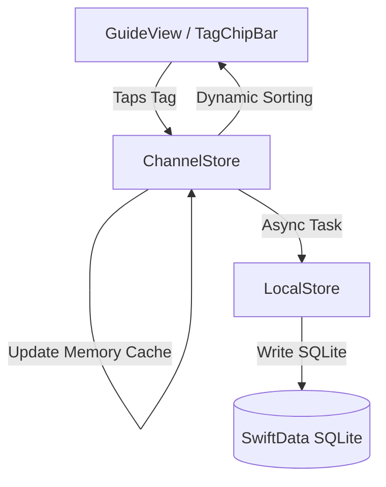

# Tag Navigation & Sorting Improvements Design Spec

A design to improve the Channel Guide's tag navigation. By implementing a hybrid sorting algorithm and visual counter badges, we reduce horizontal scrolling fatigue and make popular, dense tags easiest to tap.

## Goal Description

As the TV Guide's curated catalog and user tags grow, scrolling horizontally to locate desired tags becomes tedious. This design introduces:
1. **Smart Sorting**: Re-orders tags dynamically so that tags with the most user visits (popularity) and most channels (content density) bubble to the left.
2. **Modern Counter Badges**: Replaces verbose tag count text (e.g. "X vids") with a clean, modern capsule count badge inline with each tag chip.
3. **Non-Blocking Threading**: Avoids main-thread blocking by caching tag counts in memory and writing updates asynchronously to SwiftData.

## Proposed Changes



### 1. Persistence Layer

#### [MODIFY] [PersistenceModels.swift](file:///Users/kevm/github/televista/Sources/Persistence/PersistenceModels.swift)
Add the `TagUsageRecord` model to store selection history.

```swift
@Model
final class TagUsageRecord {
    @Attribute(.unique) var tagID: String
    var tapCount: Int

    init(tagID: String, tapCount: Int = 0) {
        self.tagID = tagID
        self.tapCount = tapCount
    }
}
```

#### [MODIFY] [LocalStore.swift](file:///Users/kevm/github/televista/Sources/Persistence/LocalStore.swift)
Add methods to increment and retrieve tag selection counts.

```swift
// MARK: Tag Usage History
func incrementTagTapCount(tagID: String) {
    let descriptor = FetchDescriptor<TagUsageRecord>(predicate: #Predicate { $0.tagID == tagID })
    if let record = (try? context.fetch(descriptor))?.first {
        record.tapCount += 1
    } else {
        context.insert(TagUsageRecord(tagID: tagID, tapCount: 1))
    }
    try? context.save()
}

func tagTapCounts() -> [String: Int] {
    let descriptor = FetchDescriptor<TagUsageRecord>()
    let records = (try? context.fetch(descriptor)) ?? []
    var dict: [String: Int] = [:]
    for r in records {
        dict[r.tagID] = r.tapCount
    }
    return dict
}
```

#### [MODIFY] [Persistence.swift](file:///Users/kevm/github/televista/Sources/Persistence/Persistence.swift)
Include `TagUsageRecord.self` in the `Schema` array.

---

### 2. Business Logic Layer

#### [MODIFY] [ChannelStore.swift](file:///Users/kevm/github/televista/Sources/Stores/ChannelStore.swift)
Manage in-memory popularity state and execute the hybrid sorting.

* Add properties:
  ```swift
  @Published private(set) var tagTapCounts: [String: Int] = [:]
  @Published private(set) var tagChannelCounts: [String: Int] = [:]
  ```
* In `reloadLineup()`, compute tag counts dynamically and perform the hybrid sort:
  ```swift
  // Compute channel counts per tag
  var counts: [String: Int] = [:]
  for channel in channels {
      for tagID in channel.tagIDs {
          counts[tagID, default: 0] += 1
      }
  }
  self.tagChannelCounts = counts

  // Sort tags by: visits (desc) -> content density (desc) -> alphabetical name (asc)
  self.chipTags = allTags.sorted { a, b in
      let aTaps = tagTapCounts[a.id, default: 0]
      let bTaps = tagTapCounts[b.id, default: 0]
      if aTaps != bTaps {
          return aTaps > bTaps
      }
      let aCount = tagChannelCounts[a.id, default: 0]
      let bCount = tagChannelCounts[b.id, default: 0]
      if aCount != bCount {
          return aCount > bCount
      }
      return a.name.localizedCaseInsensitiveCompare(b.name) == .orderedAscending
  }
  ```
* Load database popularity on startup inside `setupInitialLineup()` or `init`:
  ```swift
  self.tagTapCounts = localStore.tagTapCounts()
  ```
* Increment popularity in-memory instantly and persist asynchronously in `toggleTag`:
  ```swift
  func toggleTag(_ id: String) {
      if selectedTagIDs.contains(id) {
          selectedTagIDs.remove(id)
      } else {
          selectedTagIDs.insert(id)
          tagTapCounts[id, default: 0] += 1
          Task {
              localStore.incrementTagTapCount(tagID: id)
          }
      }
      reloadLineup()
  }
  ```

---

### 3. User Interface Layer

#### [MODIFY] [TagChipBar.swift](file:///Users/kevm/github/televista/Sources/UI/TagChipBar.swift)
Expose and render the new badge styling.

```swift
struct TagChipBar: View {
    let tags: [Tag]
    let selected: Set<String>
    let counts: [String: Int]
    let onToggle: (String) -> Void

    var body: some View {
        ScrollView(.horizontal, showsIndicators: false) {
            HStack(spacing: 8) {
                chip(title: "All", count: nil, isOn: selected.isEmpty) { onToggle("__all__") }
                ForEach(tags) { tag in
                    chip(title: tag.name, count: counts[tag.id, default: 0], isOn: selected.contains(tag.id)) {
                        onToggle(tag.id)
                    }
                }
            }
            .padding(.horizontal, 16)
        }
    }

    private func chip(title: String, count: Int?, isOn: Bool, action: @escaping () -> Void) -> some View {
        Button(action: action) {
            HStack(spacing: 6) {
                Text(title)
                    .font(.subheadline.weight(isOn ? .bold : .regular))
                
                if let count = count {
                    Text("\(count)")
                        .font(.caption2.bold())
                        .padding(.horizontal, 5)
                        .padding(.vertical, 1.5)
                        .background(isOn ? Color.black.opacity(0.12) : Color.white.opacity(0.15))
                        .foregroundStyle(isOn ? Color.black.opacity(0.7) : Color.white.opacity(0.7))
                        .clipShape(Capsule())
                }
            }
            .padding(.vertical, 6)
            .padding(.horizontal, 12)
            .background(isOn ? Color.white : Color.white.opacity(0.12))
            .foregroundStyle(isOn ? Color.black : Color.white)
            .clipShape(Capsule())
        }
        .buttonStyle(.plain)
    }
}
```

#### [MODIFY] [GuideView.swift](file:///Users/kevm/github/televista/Sources/UI/GuideView.swift)
Pass the counts mapping to the chip bar:
```swift
TagChipBar(
    tags: store.chipTags,
    selected: store.selectedTagIDs,
    counts: store.tagChannelCounts
) { id in
    withAnimation {
        if id == "__all__" { store.selectedTagIDs.removeAll() } else { store.toggleTag(id) }
    }
    store.startBackgroundScan()
}
```

---

## Verification Plan

### Automated Tests
- **`PersistenceTests`**: Verify saving/incrementing tap counts in `LocalStore` behaves correctly.
- **`ChannelStoreTests`**:
  - Verify that tags are correctly sorted initially based on active channel counts.
  - Verify that selecting/tapping a tag updates the in-memory cache and re-sorts that tag to the front.
  - Verify that the sort is case-insensitive for alphabetical tie-breakers.

### Manual Verification
- Launch the simulator, open the Guide view, and check the tag bar:
  - Verify tags with the most channels appear first.
  - Tap on a tag to select it, then tap "All" to clear filtering. Verify that the tapped tag immediately animates to the front of the list.
  - Check that tag counts are displayed in neat capsule badges, conforming to the refined SwiftUI spacing.
